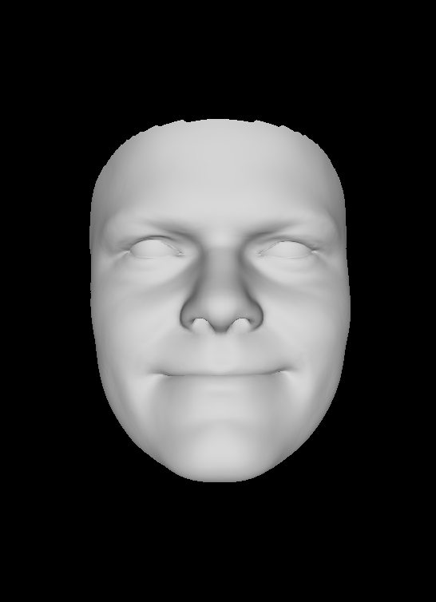
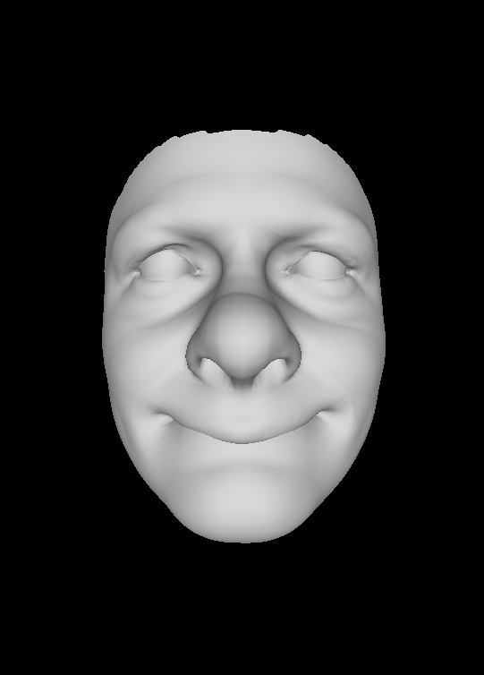
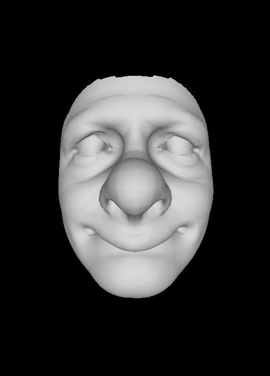
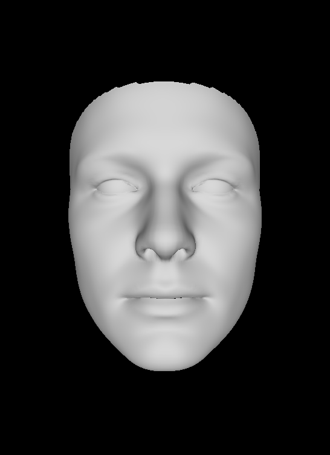
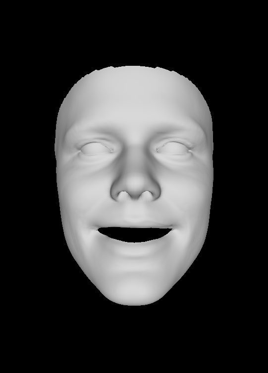
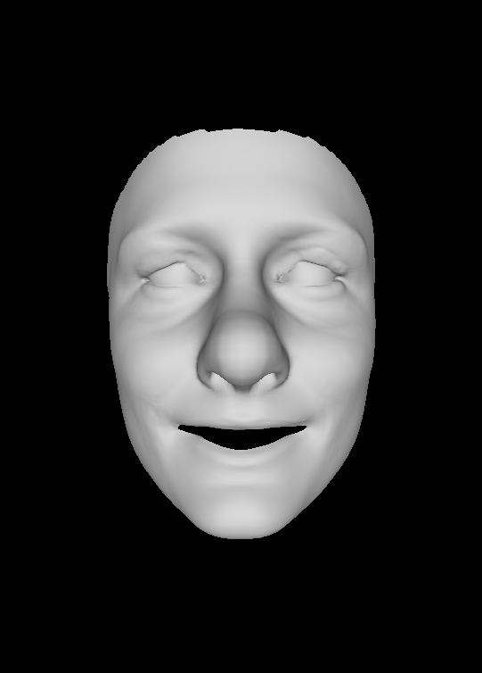

# Computational caricaturization of surfaces

This is an unofficial reproduction of "Computational caricaturization of surfaces" by Martan Sela, Yonathan Aflalo, and Ron Kimmmel. (CVIU 2015).

## Building

### Requirement

* Eigen3
* CMake

### Build Command

`mkdir build && cmake -DCMAKE_BUILD_TYPE=Release ../ && make`

## Demo executable

```
Usage 1: <executable> ref <reference .obj file> <target .obj file> <beta (default 0.2)> <output .obj path (default: output.obj)>
Usage 2: <executable> noref <target .obj file> <gamma (default 0.2)> <output .obj path (default: output.obj)>
```

For the semantics of the exaggeration factors beta and gamma, please refer to the paper. 0.0 means no exaggeration at all. Put values somewhere between 0.0 to 0.8.

## Demo

### Without reference

#### Input



#### Result with gamma = 0.2



#### Result with gamma = 0.3



### With reference

#### Reference



#### Reference



#### Result with beta = 0.6



## Discussion

* Although the algorithm may give us interesting shapes, this algorithm largely modifies global scale of input mesh (i.e. the size of the bounding box). There may be some possible improvements.
* The formulation for with-reference case is modified. (at src/compcari.cpp:131, negative sign before std::log is added). This seems like a typo of the paper.

## Disclaimer

The meshes used in the examples are generated using the Basel face model (Paysan, P., Knothe, R., Amberg, B., Romdhani, S., & Vetter, T. (2009, September). A 3D face model for pose and illumination invariant face recognition. In 2009 Sixth IEEE International Conference on Advanced Video and Signal Based Surveillance (pp. 296-301). Ieee.). **The LICENSE only covers my code (src/ include/ demo/), not example meshes.**